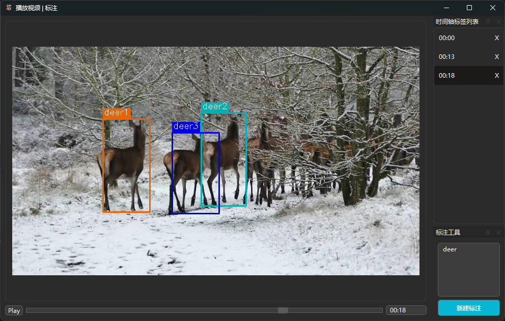

# Label Pig
AI 辅助标注视频目标标注工具，使用 [GroundingDINO](https://github.com/IDEA-Research/GroundingDINO) 服务进行视频目标检测



## Installation
初次使用需要安装依赖
```bash
python -m pip install -r requirements.txt
```
Python 版本 3.5 以上均可，有问题可以提 issue

## Usage
启动方式：运行主文件
```
python main.py
```

### 流程

将需要标注的视频放在 `videos` 文件夹中，然后运行 `main.py`。程序会自动检测视频并生成 `./videos/.cache` 文件夹，其中包含每个视频的缩略图和参数。

观看视频时，在标注工具中输入要标注的物体名称（多个物体用 `.` 分隔），点击 `新建标注`。这会发送请求到 GroundingDINO 服务，获取物体在图片上的标注框信息。保存标注后，标注文件会以 `.json` 格式保存在 `labels` 文件夹中。

# 服务端（可选）
需要 [GroundingDINO](https://github.com/IDEA-Research/GroundingDINO) 图像标注服务，可以直接使用他人搭建好的。本人的服务地址已经在代码里，但是不保证服务24小时在线。

如果需要自己部署:
1. 在 `./service` 文件夹下有额外的依赖 `requirements.txt`，安装它里面的依赖

2. 同时准备 pytorch (建议在有Nvidai显卡的主机上安装cuda版的torch)

3. 需要一个模型文件[`groundingdino_swint_ogc.pth`](https://github.com/IDEA-Research/GroundingDINO/releases/download/v0.1.0-alpha/groundingdino_swint_ogc.pth)，放到 `./service/groundingdino/weights/groundingdino_swint_ogc.pth`

4. 在 `service` 文件夹下运行 `python run_api.py`

5. 修改 `modules/api.py` 里的 `BASE_URL` 为自己的服务地址，然后重启主程序

# Todo
- [x] 任意帧增加标注，删除标注，展示时间维度已有标注并允许跳转
- [ ] 区间标注功能
- [ ] 标注数据导出为 Ultralitics 支持的格式
- [ ] 样式优化